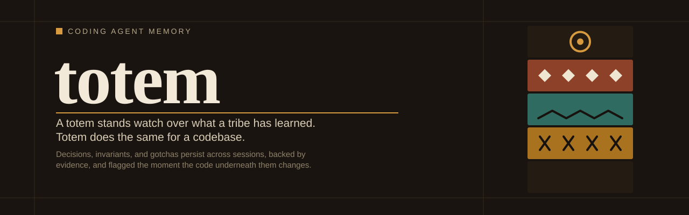

<p align="center">
  
</p>
<p align="center" style="font-size:10em;">
  <h1 align="center">totem</h1>
</p>
<p align="center">
  <em>Totem stands watch over what a tribe has learned. It does the same for your codebase.</em>
</p>
<p align="center">
  <a href="https://www.npmjs.com/package/@emiliano-go/totem">
    
  </a>
  <a href="https://pypi.org/project/totem-mcp/">
    
  </a>
  <a href="https://pypi.org/project/totem-mcp/">
    
  </a>
  <a href="LICENSE">
    
  </a>
  <a href="https://modelcontextprotocol.io">
    
  </a>
</p>

---

A totem stands watch over what a tribe has learned. Totem does the same for a codebase. It's a Git-aware memory server for coding agents: decisions, invariants, and gotchas persist across sessions, backed by evidence, and flagged the moment the code underneath them changes.

## Why

AI coding agents lose engineering context between sessions. They re-discover the same gotchas, re-debate the same decisions, and forget invariants that were already established. `totem` persists this knowledge locally and serves it back to agents as structured context, ordered by relevance.

## Install

Requires Python 3.13+.

```bash
npm install @emiliano-go/totem
npx @emiliano-go/totem
```

The `npx` command auto-installs or upgrades the Python MCP server, pins its version, and configures enforcement plugins for OpenCode, Claude Code, and Kimi Code. For Kimi Code it also registers a user-level MCP entry (`~/.kimi-code/mcp.json`) so totem is available in every project.

### Supported agents

| Agent | Hook type | Auto-configured? |
|-------|-----------|-----------------|
| OpenCode | `tool.execute.before` JS plugin | Yes |
| Claude Code | `PreToolUse`/`PostToolUse` hooks (`~/.claude/settings.json`) | Yes |
| Kimi Code | `[[hooks]]` in `~/.kimi-code/config.toml` | Yes |

## Features

- **14 memory types** with type-specific metadata validation
- **31 MCP tools** (16 core + 15 typed wrappers)
- **Staleness detection** via SHA256 content hashing on evidence
- **Conflict detection** on overlapping evidence and contradictory claims
- **Full-text search** via Turso FTS5
- **Hybrid memory** (project + user databases)
- **Context assembly** with scored pipeline and token budget
- **Agent enforcement** blocks reads/grep/bash when memory exists, forces search-first workflow
- **Commit gates** block all tools until agent registers file reads and writes
- **History audit** on every create, update, and delete

## How it works

```
Agent reads file for the first time
  → commit-gate blocks → agent registers read → memory stored → done

Agent reads file again (memory exists)
  → blocked → redirected to memory tools
  → searches memory → finds context → done

Agent writes a file
  → commit-gate blocks → agent registers write with reason → change documented → done

Agent reads file but finds nothing in memory
  → allowed to read → commit-gate requires registration → done
```

## Setup

### OpenCode

Add to `~/.config/opencode/opencode.json` (or let `npx @emiliano-go/totem` write it):

```json
{
  "plugin": ["@emiliano-go/totem"],
  "mcp": {
    "totem": {
      "type": "local",
      "command": ["uvx", "totem-mcp==<version>"],
      "enabled": true
    }
  }
}
```

The installer pins `<version>` to the npm package version and pre-warms the uvx cache, so agent startups use the cached environment and never hit the network.

### Claude Code

```bash
claude mcp add totem -- totem-mcp
```

### Kimi Code

MCP server and hooks are auto-configured by `npx @emiliano-go/totem`: the MCP server goes in user-level `~/.kimi-code/mcp.json` (every project), and the hooks go in `~/.kimi-code/config.toml`.

### Manual setup

If you prefer manual configuration:

```bash
# Initialize totem in your project
totem init

# For a different project
totem init --project /path/to/other
```

## Quick start

### MCP tools (from your agent)

```
# Store a decision
memory_create_tool(type="decision", title="Use FTS5 for search",
  statement="SQLite FTS5 is sufficient for our search needs",
  tags=["search", "sqlite"],
  metadata={"rationale": "No external dependency needed"})

# Get full context for a task
engineering_context_tool(tags=["api", "database"],
  current_task="Adding JWT refresh endpoint")

# Search memory
memory_search_tool(query="authentication", tags=["auth"])

# Store a command outcome
memory_create_tool(type="gotcha", title="uv pip install -e . works",
  statement="Editable install works with uv pip on PEP 668 systems",
  tags=["cmd:uv-pip-install", "python"])
```

### CLI

```bash
# Create a memory item
totem create --type decision --title "Use FTS5 for search" \
  --statement "SQLite FTS5 is sufficient for our search needs" \
  --tags "search,sqlite" --metadata '{"rationale": "No external dependency needed"}'

# Search
totem search --query "FTS5" --tags "sqlite"

# Assemble context
totem context --tags "search,sqlite" --current-task "Implementing search" --budget 4096

# Export/import
totem export -o backup.json
totem import backup.json
```

## Memory types

| Type | Purpose | Required metadata |
|------|---------|------------------|
| `decision` | A choice that was made | `rationale` (recommended) |
| `invariant` | A rule that must hold | `verificationMethod`, `condition` |
| `gotcha` | A non-obvious pitfall | (none) |
| `rejected_idea` | A proposal declined | `proposal`, `reasonRejected` |
| `assumption` | A claim with epistemic status | `claimCategory`, `basis` |
| `open_question` | An unresolved question | `question`, `impact`, `blocking` |
| `ambiguity` | An ambiguous requirement | `question`, `interpretations`, `impact` |
| `contract` | Observable behavior | `subject` |
| `constraint` | Implementation restriction | `constraint` |
| `hypothesis` | Plausible explanation | `hypothesis` |
| `observation` | Something seen in code | `observation` |
| `bug` | A defect with state machine | `symptom`, `severity`, `state` |
| `architecture` | Component mapping | `component`, `responsibility` |
| `implementation` | Codebase facts | `subject`, `kind`, `path` |

## MCP tools (31)

| Tool | Description |
|------|-------------|
| `totem_init_tool` | Initialize totem for a project |
| `memory_create_tool` | Create a memory item (warns on duplicate title) |
| `memory_get_tool` | Retrieve by ID with staleness check |
| `memory_update_tool` | Update any field (provides audit trail) |
| `memory_delete_tool` | Soft-delete (requires `reason`) |
| `memory_list_tool` | Filtered listing with sort and type/tag filters |
| `memory_recent_tool` | List recently created memories |
| `memory_tasks_tool` | List in-progress task memories (`task:*`) |
| `memory_commands_tool` | List command outcomes (`cmd:*`) |
| `memory_search_tool` | FTS5 full-text search with type/tag filters |
| `resolve_conflict_tool` | Mark conflict as resolved |
| `engineering_context_tool` | Scored context assembly with task relevance |
| `memory_export_tool` | Export all memories as JSON |
| `memory_import_tool` | Import memories from JSON (skips duplicates) |
| `register_file_read_tool` | Store facts learned from reading a file (auto-hashes) |
| `register_file_write_tool` | Register file changes with reason (auto-hashes) |
| `*_create` (14) | Typed wrappers for each memory type |
| `flag_ambiguity` | Convenience wrapper for ambiguity creation |

## CLI commands (14)

| Command | Description |
|---------|-------------|
| `totem init` | Initialize totem and install agent instructions |
| `totem create` | Create a new memory item |
| `totem get <ID>` | Retrieve by ID |
| `totem update <ID>` | Update an item |
| `totem delete <ID>` | Soft-delete (requires `--reason`) |
| `totem list` | List with filters |
| `totem recent` | List recently created memories |
| `totem tasks` | List in-progress task memories |
| `totem commands` | List command outcomes |
| `totem resolve <ID>` | Mark conflict as resolved |
| `totem search` | Full-text search |
| `totem export` | Export memories as JSON |
| `totem import <FILE>` | Import memories from JSON |
| `totem context` | Assemble scored context |

## Context assembly

**Scoring formula:**
```
score = 0.30*tag_match + 0.20*task_similarity + 0.25*importance
      + 0.15*confidence + 0.10*recency
```

Invariants, constraints, and ambiguities get a 1.25x multiplier. Potentially stale items get a 0.5x penalty.

**Output sections (BLOCKING AMBIGUITIES, CONFLICTS, and STALE WARNINGS are never budget-truncated):**

1. TASK (if provided)
2. BLOCKING AMBIGUITIES
3. CONTEXT CONFLICTS
4. CRITICAL CONSTRAINTS
5. CRITICAL INVARIANTS
6. RELEVANT CONTRACTS
7. ARCHITECTURE
8. DECISIONS
9. KNOWN AMBIGUITIES (non-blocking)
10. OBSERVATIONS
11. GOTCHAS
12. KNOWN BUGS
13. HYPOTHESES
14. CODEBASE FACTS
15. OPEN QUESTIONS
16. REJECTED IDEAS
17. STALE KNOWLEDGE WARNINGS

## Workspace scoping

totem auto-detects your project root via `git rev-parse --show-toplevel`. Override with `--project <path>` on any CLI command or `project` parameter on any MCP tool.

## Hybrid memory

- **Project memories**: `.totem/totem.db`
- **User memories**: `~/.local/share/totem/totem.db`

`engineering_context` searches both, with project memories taking precedence.

## Tag conventions

- `task:<name>`: In-progress work. Query with `memory_tasks_tool`.
- `cmd:<command>`: Command outcomes. Query with `memory_commands_tool`.
- `architecture:<module>`: Structural facts about a module.
- `outcome:<what>`: Measurable results (performance wins, bug fix impact, etc.).

## Companion skill

The [`skills/precision-first/`](skills/precision-first/SKILL.md) directory contains a precision-first software engineering methodology designed to pair with `totem`.

## Development

```bash
# Run JS tests
cd plugins/totem-enforce && node test-tokenize.js

# Run Python package tests
uv run pytest

# Run Python hook tests
cd plugins/totem-enforce && python3 test-enforce.py
```

## License

MIT
